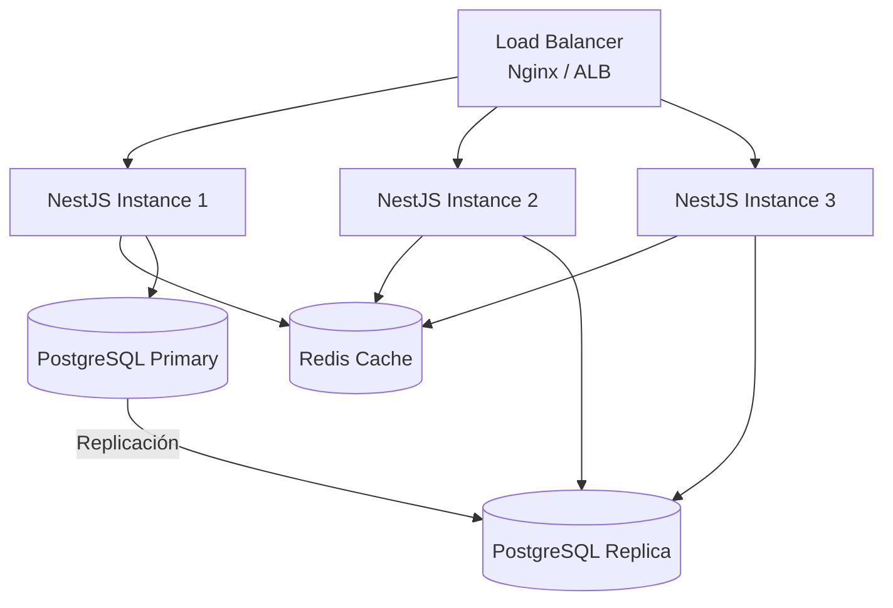
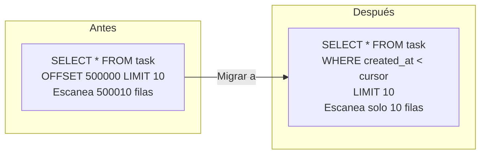
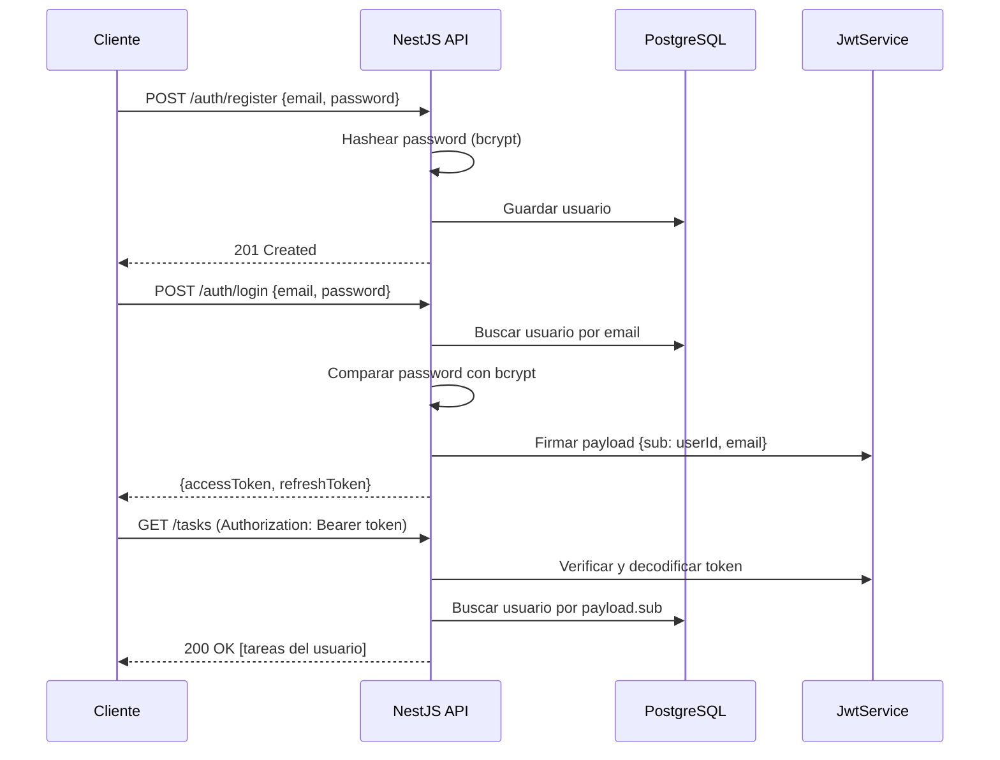
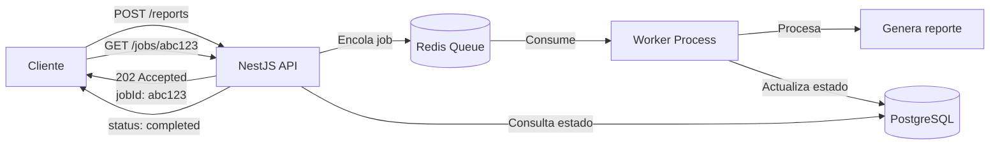

# Parte 4 - Diseño de Arquitectura

## 1. ¿Cómo escalaría esta API para soportar 1000 requests por segundo?

Levantaría múltiples instancias detrás de un balanceador de carga que distribuya las peticiones entre ellas.



En producción esto se puede hacer con PM2 en modo cluster (`pm2 start dist/main.js -i max`), con Docker + Kubernetes, o con servicios cloud como Elastic Container Service (ECS) de AWS. El balanceador de carga puede ser Nginx o un Application Load Balancer (ALB) de AWS con estrategia round-robin o least-connections.

También usaría Redis como caché para reducir la carga en PostgreSQL. NestJS tiene `@nestjs/cache-manager` con soporte para Redis, y se puede aplicar por ruta con un interceptor:

```typescript
@Get(':id')
@UseInterceptors(CacheInterceptor)
@CacheTTL(60) // 60 segundos
findOne(@Param('id') id: string) {
  return this.tasksService.findOne(id);
}
```

Eso sí, hay que invalidar caché cuando se crean, actualizan o eliminan las tareas.

Para las lecturas que lleguen a la base de datos, se pueden usar replicas de lectura (read replicas) de PostgreSQL. TypeORM soporta esto de forma nativa con la opción `replication`, separando las escrituras a la base de datos primaria y las lecturas a las replicas:

```typescript
TypeOrmModule.forRoot({
  replication: {
    master: { host: 'primary.db', ... },
    slaves: [{ host: 'replica1.db', ... }, { host: 'replica2.db', ... }],
  },
})
```

Por último consideraría configurar el pool de conexiones de TypeORM (`extra.max: 20`) para no saturar PostgreSQL (o usar PgBouncer si hay muchas instancias), aplicar rate limiting con `@nestjs/throttler` para proteger la API de abuso, y monitorear con health checks de `@nestjs/terminus` junto con herramientas como Prometheus + Grafana que permitirían medir el rendimiento y detectar cuellos de botella.

## 2. ¿Qué cambios haría si el sistema creciera a millones de tareas?

Cambiaría de paginación por offset a paginación por cursor. Ahora uso `SKIP` (offset), que obliga a PostgreSQL a escanear N filas solo para descartarlas. Con 1 millón de tareas y `page=50000` con `limit=10`, PostgreSQL tiene que leer casi 500000 filas solo para descartarlas y retornar las últimas 10.



Con paginación por cursor se usa el `createdAt` o `id` de la última tarea como punto de referencia, y el frontend envía algo como `?cursor=2025-01-15T10:30:00Z&limit=10` en vez de `?page=50000`:

```typescript
// En vez de: .skip((page - 1) * limit)
// Usar:
.where('task.createdAt < :cursor', { cursor: lastCreatedAt })
.orderBy('task.createdAt', 'DESC')
.take(limit)
```

En la base de datos agregaría índices compuestos para las combinaciones de filtros más comunes. El sistema actual tiene índices simples en `status` y `priority`, pero cuando se filtra por ambos a la vez (`WHERE status = 'pending' AND priority = 'high'`), un índice compuesto es mucho más eficiente:

```typescript
@Index(['status', 'priority'])
@Index(['status', 'createdAt'])
```

Para la búsqueda por texto, el `ILIKE '%term%'` actual no puede usar índices B-tree. Con millones de registros es muy lento. La solución es un índice GIN (Generalized Inverted Index) con la extensión `pg_trgm`:

```sql
CREATE INDEX idx_task_title_trgm ON task USING GIN (title gin_trgm_ops);
```

Otros cambios que podrían ayudar a escalar con millones de tareas son:

- **Seleccionar solo lo necesario**: el listado no necesita la `description` completa. Traer solo las columnas que se muestran reduce el I/O:
  ```typescript
  .select(['task.id', 'task.title', 'task.status', 'task.priority', 'task.createdAt'])
  ```
- **Particionar por soft delete**: si las tareas eliminadas crecen mucho, se puede particionar la tabla por `deletedAt IS NULL / IS NOT NULL` para que las queries del día a día solo toquen las tareas activas.
- **Estimar el total en vez de contar**: reemplazar el `COUNT(*)` exacto con una estimación de PostgreSQL (`SELECT reltuples::bigint FROM pg_class WHERE relname = 'task'`) es mucho más rápido para el paginador.
- **Cachear los filtros más comunes**: tareas pendientes, alta prioridad, etc. se pueden cachear en Redis e invalidar por eventos.
- **Archivar tareas viejas**: mover tareas completadas hace más de N meses a una tabla `task_archive` mantiene la tabla principal pequeña.

## 3. ¿Cómo implementaría autenticación JWT en este sistema?

Usaría los módulos `@nestjs/jwt` y `@nestjs/passport` con la estrategia `passport-jwt`. El flujo completo sería así:



A nivel de código, crearía un módulo de autenticación con esta estructura:

```
src/auth/
├── auth.module.ts
├── auth.controller.ts      (login, register, refresh)
├── auth.service.ts          (lógica de autenticación)
├── strategies/
│   └── jwt.strategy.ts      (validación del token)
├── guards/
│   └── jwt-auth.guard.ts    (protege rutas)
├── decorators/
│   └── current-user.decorator.ts
└── dto/
    ├── login.dto.ts
    └── register.dto.ts
```

Necesitaría una entidad `User` con campos `id`, `email`, `password` (hasheado con bcrypt) y una relación `OneToMany` con Task, para que cada tarea pertenezca a un usuario.

La `JwtStrategy` se encargaría de validar el token y verificar que el usuario siga existiendo y esté activo:

```typescript
@Injectable()
export class JwtStrategy extends PassportStrategy(Strategy) {
  constructor(config: ConfigService, private usersService: UsersService) {
    super({
      jwtFromRequest: ExtractJwt.fromAuthHeaderAsBearerToken(),
      secretOrKey: config.get<string>('JWT_SECRET'),
      ignoreExpiration: false,
    });
  }

  async validate(payload: { sub: string }): Promise<User> {
    const user = await this.usersService.findById(payload.sub);
    if (!user || !user.isActive) {
      throw new UnauthorizedException();
    }
    return user;
  }
}
```

Registraría `JwtAuthGuard` como guard global usando `APP_GUARD`. Entonces, todas las rutas quedarían protegidas por defecto, y las rutas públicas (como login y register) se marcan con un decorator `@Public()` que usa `SetMetadata`. El guard revisa el metadata antes de exigir autenticación:

```typescript
@Public()
@Post('login')
login(@Body() dto: LoginDto) { ... }
```

Para la relación User-Task, agregaría un campo `userId` a la entidad Task y filtraría las queries por el usuario autenticado, de modo que cada usuario solo pueda ver y modificar sus propias tareas.

En cuanto a seguridad, los access tokens tendrían un tiempo de vida (TTL) de 15 minutos y los refresh tokens de 7 días almacenados hasheados en la base de datos. El `JWT_SECRET` se leería de variables de entorno con ConfigModule. El payload del JWT solo incluiría `sub` (userId) y `email`, nunca passwords ni datos sensibles. Las contraseñas se hashearían con bcrypt usando salt rounds con un valor mayor o igual a 10. Y agregaría `helmet` como middleware para headers HTTP de seguridad.

## 4. ¿Cómo manejaría procesamiento asincrónico para tareas pesadas?

Usaría `@nestjs/bullmq` que es la integración oficial de NestJS con BullMQ sobre Redis. La idea es que el controller solo encola el trabajo y responde inmediatamente con un 202 Accepted, mientras un worker aparte lo procesa en segundo plano.



La configuración de la cola es bastante directa:

```typescript
@Module({
  imports: [
    BullModule.forRoot({ connection: { host: 'localhost', port: 6379 } }),
    BullModule.registerQueue({ name: 'heavy-tasks' }),
  ],
})
export class QueueModule {}
```

El controller actúa como producer, encolando el job sin ejecutarlo:

```typescript
@Post('reports')
async generateReport(@Body() dto: ReportDto) {
  const job = await this.queue.add('generate-report', dto, {
    attempts: 3,
    backoff: { type: 'exponential', delay: 5000 },
  });
  return { jobId: job.id, status: 'queued' };
  // Responde 202 inmediatamente, sin esperar
}
```

El consumer es un worker separado que procesa los jobs y puede reportar progreso:

```typescript
@Processor('heavy-tasks')
export class HeavyTasksProcessor {
  @Process('generate-report')
  async handleReport(job: Job<ReportDto>) {
    await job.updateProgress(10);
    const data = await this.fetchData(job.data);
    await job.updateProgress(50);
    const report = await this.buildReport(data);
    await job.updateProgress(100);
    return report;
  }
}
```

Y el cliente puede consultar el estado del job con un endpoint separado:

```typescript
@Get('jobs/:id')
async getJobStatus(@Param('id') id: string) {
  const job = await this.queue.getJob(id);
  return {
    status: await job.getState(),
    progress: job.progress,
    result: job.returnvalue,
  };
}
```

Comparado con ejecutar todo en el request, usar BullMQ tiene varias ventajas. 
- El tiempo de respuesta es inmediato (202 Accepted) en vez de bloquear hasta que termine. 
- Los reintentos son automáticos con backoff exponencial.
- Se puede ver el progreso del job.
- Si el servidor se cae, el job persiste en Redis y se puede retomar.
- Se puede escalar con N workers consumiendo de la misma cola.

| Aspecto | Sin cola | Con BullMQ |
|---------|----------|------------|
| Tiempo de respuesta | Bloqueado hasta completar | Inmediato (202 Accepted) |
| Reintentos automáticos | No | Sí, con backoff exponencial |
| Visibilidad del progreso | Ninguna | job.progress + job.getState() |
| Resistencia a fallos | Si el server cae, el trabajo se pierde | El job persiste en Redis |
| Escalabilidad | Limitado a una instancia | N workers pueden consumir de la misma cola |

Esta solución aplicaría en diversos escenarios, tales como envío de emails (si el servicio falla, BullMQ reintenta automáticamente), procesamiento de archivos (subir, encolar, notificar cuando termine), o jobs programados con expresiones cron (limpieza de datos, reportes diarios).

Como complemento, para comunicación entre módulos dentro del mismo servicio, `@nestjs/event-emitter` es una alternativa más liviana que no necesita Redis. Es útil para side-effects que no requieren persistencia ni reintentos:

```typescript
// Emisor
this.eventEmitter.emit('task.completed', { taskId, userId });

// Listener (en otro módulo)
@OnEvent('task.completed')
async handleTaskCompleted(event: TaskCompletedEvent) {
  await this.notificationsService.send(event.userId, 'Tu tarea fue completada');
}
```

La diferencia entre ambos es que los eventos en memoria se pierden si el servidor se reinicia, mientras que los jobs en BullMQ/Redis persisten y se reintentan.
